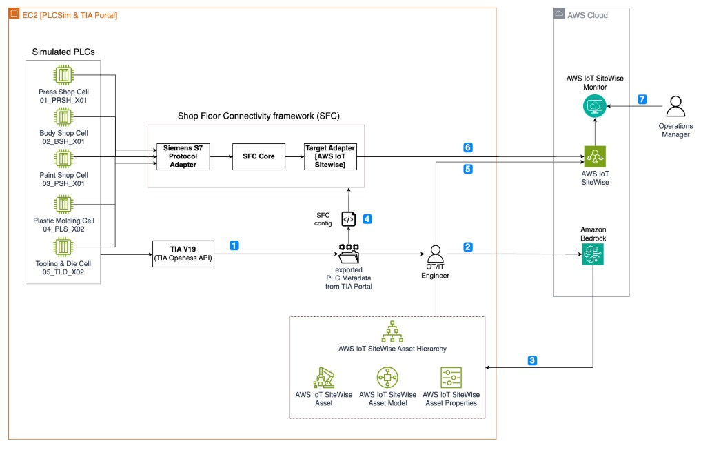

# Automatically build an industrial unified namespace with Amazon Bedrock

## Overview

This workshop provides hands-on experience in scaling industrial data ingestion to the cloud. 
You will extract asset metadata from Siemens TIA Portal, leverage generative AI to automate AWS IoT SiteWise asset modeling and configuration, 
implement bulk asset imports, set up Shop Floor Connectivity (SFC) for data collection, and build real-time data visualizations.

## Pre-requisites

1. An account for Siemens [SiePortal] (https://sieportal.siemens.com/en-us/home) in oder to download the required software.
2. AWS account. If you don't have an AWS Account follow the [instructions](https://repost.aws/knowledge-center/create-and-activate-aws-account) to create one

### Model Access

This project uses foundation models from Amazon Bedrock. You'll need to enable access to:

- **Claude 3 models**: Haiku 

<div class="alert alert-block alert-info">
<span style="font-size: 1.5em;">⚠️</span> If you do not have access to these models, the application will work, but you can to select the model you have access to in the Jupyter NB. See [Model access documentation](https://docs.aws.amazon.com/bedrock/latest/userguide/model-access.html) to enable model access in your AWS account.
</div>
  
## Solution Architecture



You need metadata from industrial control systems that are fed into Bedrock.
Out of that a complete unified namespace (UNS) hierarchy is built.
For extracting metadata for Siemens control systems TIA portal with Openness API is used.

## Contents Description

This repository contains the following:

1. [The CloudFormation template](src/cfn/uns-scale-connectivity-workshop.yaml) - This deployment will provision an Amazon EC2 instance and all the permissions and network configuration for the plant simulation setup.
2. [Jupyter Notebooks](src/workshop/jupyter-notebook/) - The three Jupyter NBs are to be executed in the sequence as they are numbered. 
3. [Scripts](src/workshop/scripts/) - These scripts contain the python code and helper functions required to execute the Jupyter NBs in the Amazon EC2 instance


## Set-up instructions

1. Deploy the CloudFormation template in your AWS account using the console or the command below. This deployment could take 15-20 mins. 
   
```bash
    aws cloudformation deploy --template-file src/cfn/uns-scale-connectivity-workshop.yaml --stack-name src/cfn/uns-scale-connectivity-workshop --capabilities CAPABILITY_NAMED_IAM
```
2. Go to the `Outputs` section of the of the CloudFormation Console and select `02WindowsInstanceRDPSSM` to use AWS Systems Fleet Manager to access your Amazon EC2 instance. 

Alternatively, You can also access this instance using your own local RDP client. Open the `03WindowsInstanceIdConsoleUrl` link. Download the remote desktop file. This file will have all parameters pre-populated for you to open with your RDP client. You have to allow RDP access of your IP Address in the security group `05SecurityGroupConsoleUrl`.

3. Retrieve your password from the `01WindowsPasswordSecret` in AWS Secrets Manager.
   
4. In the Browser, log into [SiePortal](https://sieportal.siemens.com/de-de/mysieportal). Download and install [Siemens TIA Portal](https://support.industry.siemens.com/cs/document/109820994/simatic-step-7-inkl-safety-s7-plcsim-und-wincc-v19-trial-download?dti=0&lc=de-DE)

5. Now, download and install [PLCSim Advanced](https://www.industry-mobile-support.siemens-info.com/en/article/detail/109821388)

6. Execute these scripts located in your desktop - `start_plcs.bat` and `start_tia.bat`. These will automatically start up Siemens TIA portal and load simulated PLCs with code.

<div class="alert alert-block alert-info">
<span style="font-size: 1.5em;">⚠️</span> Make sure the licenses are added into the program `Automation License Manager`. Please trigger any action (e.g. create a new FB, etc.) in TIA Portal to manually add the licenses in case they are missing.
</div>

## Run the workshop

You have now set-up the environment to the run the workshop.
Follow the [instructions](https://catalog.workshops.aws/unifiednamespace/en-US) from Chapter 3 to execute the workshop.

## Security

See [CONTRIBUTING](CONTRIBUTING.md#security-issue-notifications) for more information.

## License

This library is licensed under the MIT-0 License. See the LICENSE file.
